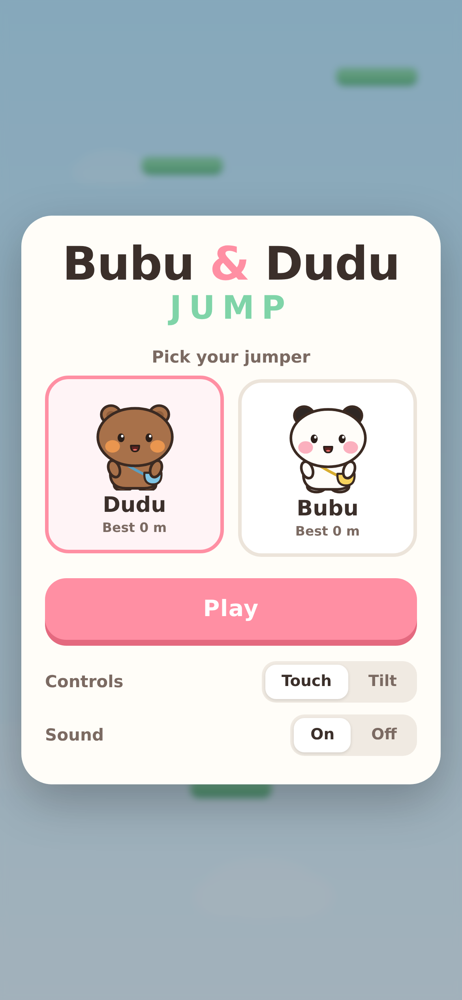
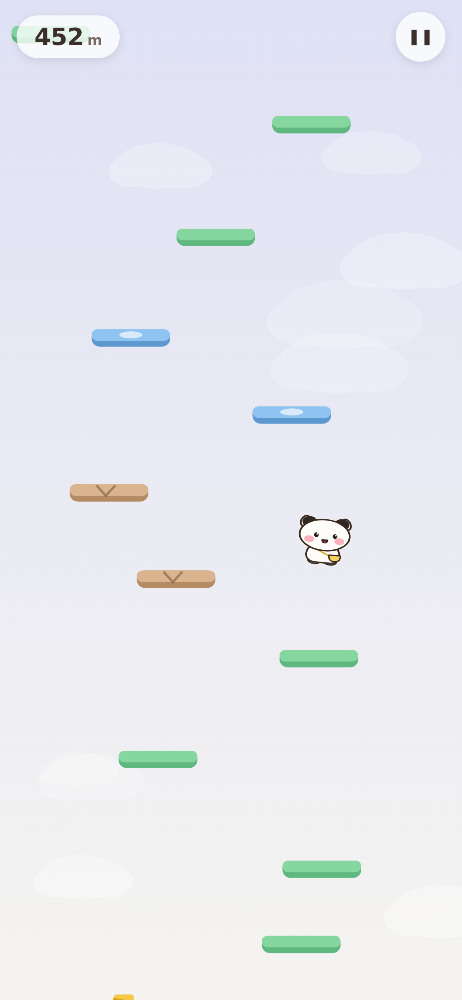

# Bubu & Dudu Jump 🐼🐻

A mobile-first Doodle Jump clone starring **Dudu** and **Bubu**. Pick your jumper,
tap-and-hold either side of the screen to steer, and climb as high as you can.

**▶ Play: https://rayray39.github.io/bubududu-jump/**

<p>
  
  
</p>

## How to play

- **Touch** (default) — hold the left or right half of the screen to move. You wrap
  around the screen edges, just like the original.
- **Tilt** — optional; switch it on in the menu and steer by tilting the phone.
  iOS asks for motion permission the first time.
- You bounce automatically. You only lose by falling off the bottom.

### Platforms

| | Platform | Behaviour |
|---|---|---|
| 🟢 | Green | Normal bounce |
| 🔵 | Blue | Slides left and right |
| 🟤 | Brown | Crumbles — you fall straight through |
| 🟡 | Spring | Launches you about 3× as high |

Breakable and moving platforms get more common the higher you climb, and the sky
changes colour as you gain altitude. Best scores are saved per character in
`localStorage`.

## Running it locally

No build step, no dependencies — it's static files.

```bash
python3 -m http.server 8911
# open http://localhost:8911
```

## Project layout

```
index.html              markup + all UI overlays
css/style.css           mobile-first styling, safe-area aware
js/characters.js        Dudu (brown bear) & Bubu (white panda), drawn procedurally
js/game.js              physics, platform generation, camera, input, rendering
assets/icon.svg         app icon
manifest.webmanifest    installable as a fullscreen home-screen app
.dev/smoke.py           headless Playwright test that bot-plays the game
```

There are no image assets — both characters and every platform are drawn with
canvas primitives, so nothing to preload and nothing that goes blurry on a
high-DPI phone screen.

## Implementation notes

- **Fixed 60 Hz timestep** with an accumulator, so physics are identical on 60 Hz
  and 120 Hz displays.
- **Logical 400px-wide coordinate space**; the canvas backing store is sized to
  `devicePixelRatio` and the height follows the device aspect ratio, so the
  playfield difficulty is the same on every phone.
- Collision is a swept check on the player's feet and only fires while falling,
  so you never clip a platform on the way up.
- Auto-pauses when the tab is hidden; `touch-action: none` and
  `overscroll-behavior: none` stop iOS pull-to-refresh and rubber-banding.

## Testing

```bash
python3 -m http.server 8911 &
python3 .dev/smoke.py
```

Boots the game in a headless iPhone-sized Chromium, drives it with a bot that
aims for the highest reachable platform, and fails on any console error or if the
bot can't sustain a climb.
